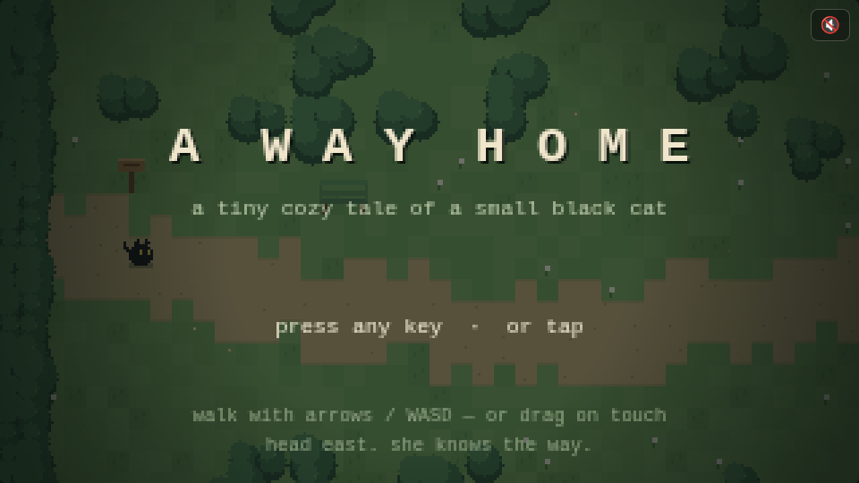
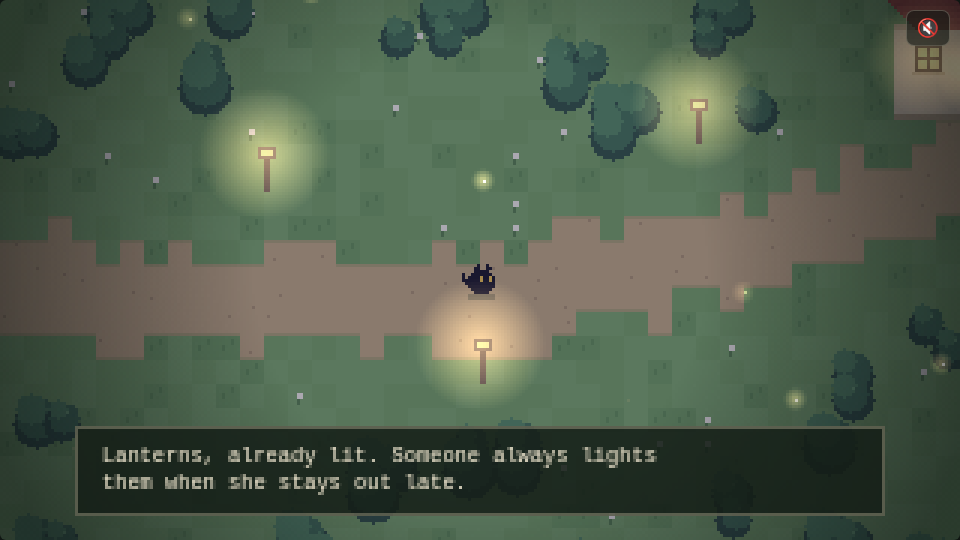

# 🐾 A Way Home

*A tiny cozy tale of a small black cat.*

The rain has finally stopped. Somewhere far to the east — past the creek,
past the pines — a warm window is waiting.

## Play

Just open **`index.html`** in any browser. No build, no dependencies —
one self-contained file.

- **Move** — arrow keys / WASD, or drag anywhere on touch
- **Sound** — tap the 🔇 button for a gentle generative music box and the
  murmur of the creek (off by default)
- Head **east**. She knows the way.

## The journey

Cross the old wooden bridge, wander the clover meadow as the first
fireflies wake, pick your way over the stepping stones, and follow the
lanterns home as dusk settles over the world.

## How it's made

- Single HTML file, vanilla JavaScript, `<canvas>` at 320×180 scaled up
  for that chunky pixel look
- The whole world (creeks, path, forest, flowers) is procedurally
  generated from a fixed seed — same cozy world every time
- Day fades to dusk as you travel east; lanterns and windows begin to glow
- Ambient touches: drifting leaves, butterflies, chimney smoke, a frog
  that ribbits when you get close, and a cat that sits down and blinks
  if you let her rest
- Audio is generated with the Web Audio API — a pentatonic music box with
  a soft delay, and filtered noise for the creek that swells as you near
  the water
