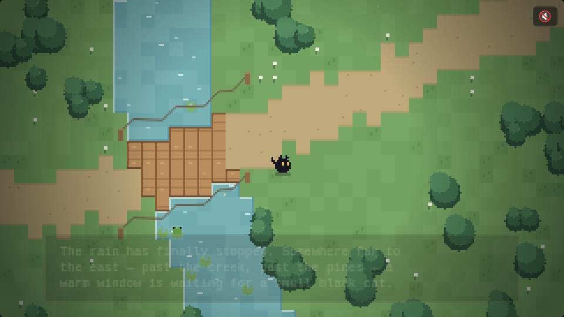
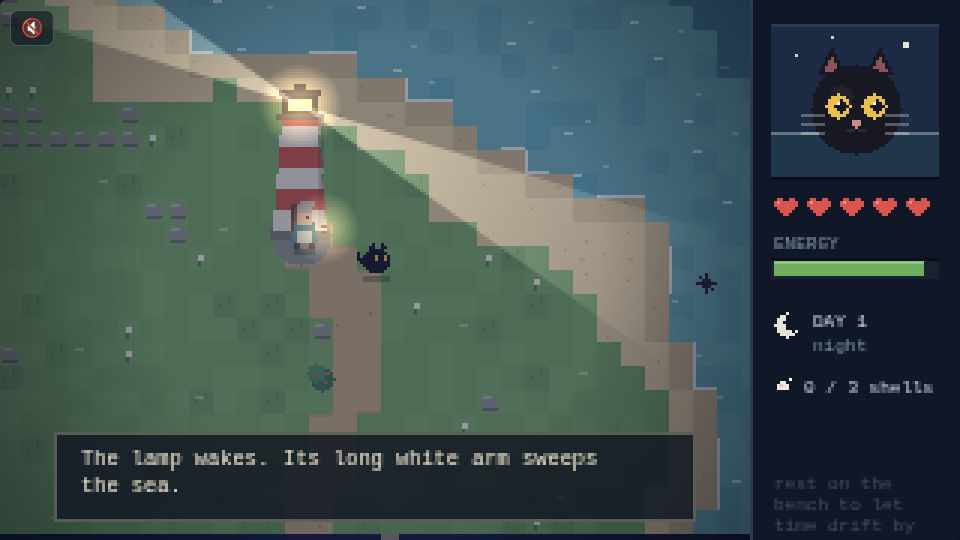

# 🐾 The Cozy Arcade

*Tiny tales of a small black cat.*

A collection of cozy pixel games. Every game is a **single self-contained
HTML file** — vanilla JavaScript and a `<canvas>`, no builds, no
dependencies, no accounts. Open `index.html` for the arcade shelf, or dive
straight into any game's folder.

| Game | Folder | What it is |
|---|---|---|
| **A Way Home** | [`a-way-home/`](a-way-home/) | The original. Cross the creek, follow the lanterns, find the warm window far to the east. |
| **The Lighthouse** | [`lighthouse-island/`](lighthouse-island/) | Explore an island with Maren the keeper. Swim (energy bar), dodge urchins (5 hearts), find her lost shells, earn a red scarf. Big cat portrait status panel. |
| **Firefly Catcher** | [`firefly-catcher/`](firefly-catcher/) | One jar, one meadow, one setting moon. Pounce on drifting lights — then let them all go. |
| **Creek Fishing** | [`creek-fishing/`](creek-fishing/) | A bamboo rod and eight things that might tug the line. Fill the journal, one gentle catch at a time. |
| **Little Garden** | [`little-garden/`](little-garden/) | Till, plant, water, wait. Crops grow in real time — even while you're away (localStorage). Shoo the crows. |
| **Star Paths** | [`star-paths/`](star-paths/) | Connect five constellations from the cottage roof — five chapters of how she found her way home. |

## Playing

- **Desktop:** arrow keys / WASD (plus per-game keys shown on each title screen)
- **Phone / tablet:** drag anywhere to walk, tap to act
- **Sound:** every game starts muted — tap the 🔇 button for generative
  Web Audio ambience (music box, creek, crickets, waves…)

## How it's made

- 320×180 pixel canvas scaled up for the chunky look, worlds procedurally
  generated from fixed seeds
- All art is drawn in code — no image assets anywhere
- All audio is generated with the Web Audio API — no sound files either
- Vibe-coded by a human and a robot, one cozy idea at a time 🖤
